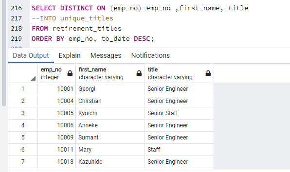
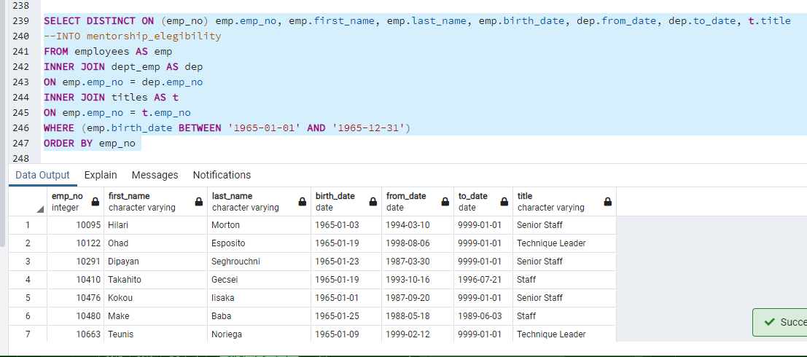

# MODULE 7 Challenge
## OVERVIEW OF THE ANALYSIS
This analysis was made in order to see how the information can be retreived from using SQL and we can see the results made in different tables, which are made to see the data that is needed, this data can be used to help the company identify certain enployees of interest, in this case, employees that are eligible for some programs or employees that can retire from the company, knowing the time the have been working for the company.

## RESULTS
As we can see in the results of every derivable in which we have different information such as the number of employees retiring from the enterprise, knowing this information, we can know which titles are free to find other candidates.

In derivable two we are looking for people that can enter into the mentorship program, knowing their information and their title inside the enterprise.

## SUMMARY
- How many roles will need to be filled as the "silver tsunami" begins to make an impact?
    - There are going to be needed to fill 41,380 positions because that's the number of people who are going to retire.

- Are there enough qualified, retirement-ready employees in the departments to mentor the next generation of Pewlett Hackard employees?
    -   There are only 1,940 of qualified persons to mentor the new employees in the enterprise, we can see that if each of this qualified employees need to mentor around 22 new iemployees entering into the enterprise.